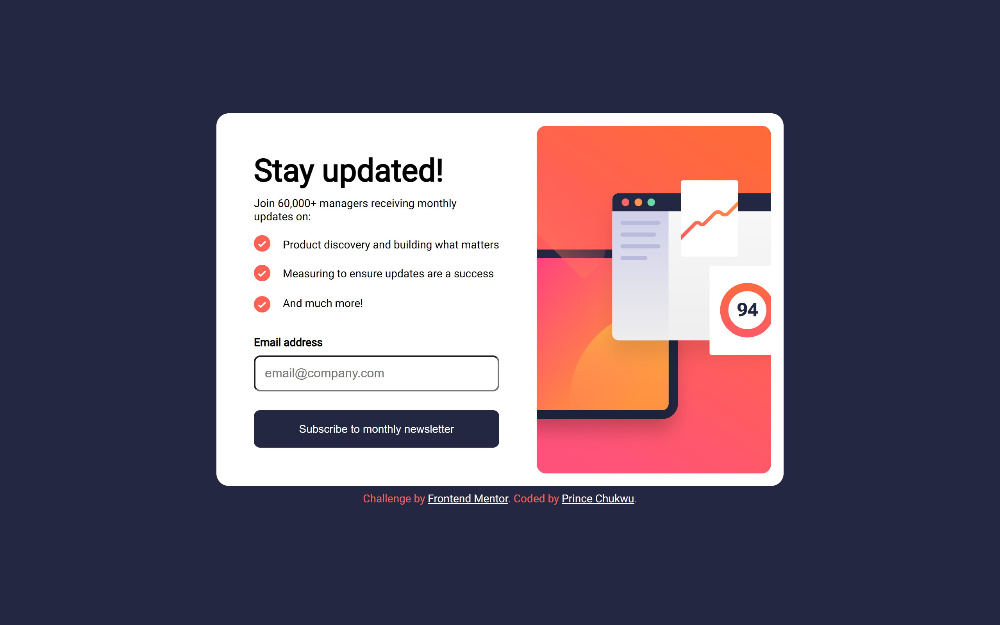
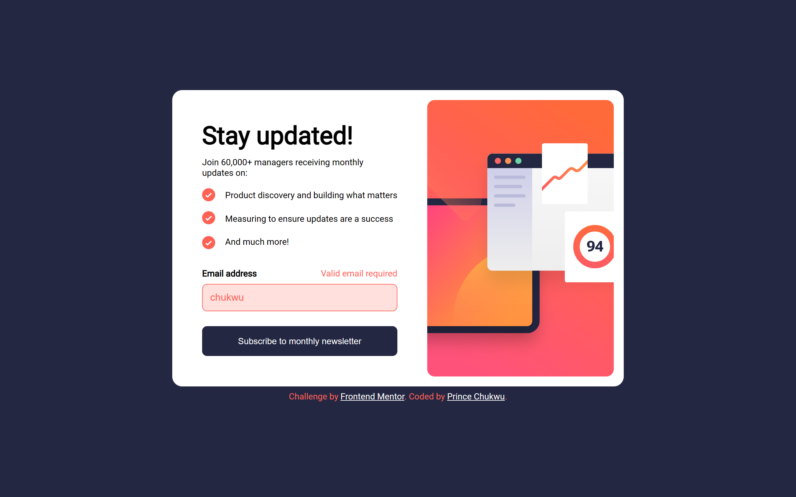
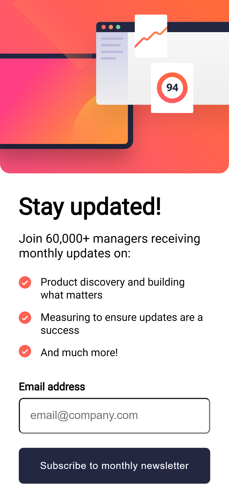
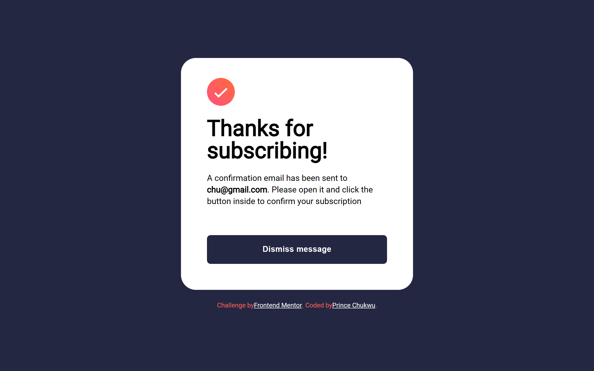
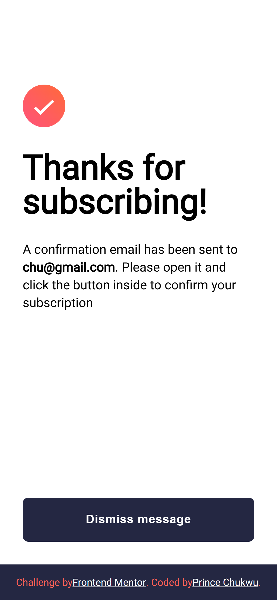

# Frontend Mentor - Newsletter sign-up form with success message solution

This is a solution to the [Newsletter sign-up form with success message challenge on Frontend Mentor](https://www.frontendmentor.io/challenges/newsletter-signup-form-with-success-message-3FC1AZbNrv). Frontend Mentor challenges help you improve your coding skills by building realistic projects.

## Table of contents

- [Overview](#overview)
  - [Screenshot](#screenshot)
  - [Links](#links)
  - [Built with](#built-with)
- [Author](#author)

## Overview

### Screenshot

### Links

- Solution URL: [Add solution URL here](https://github.com/cprincec/frontendmentor/tree/main/newsletter-sign-up-with-success-message-main)
- Live Site URL: [Add live site URL here](https://cprincec.github.io/frontendmentor/newsletter-sign-up-with-success-message-main)

### Built with

- Semantic HTML5
- CSS
- JavaScript

## Author

- Website - [Prince Chukwu]
- Frontend Mentor - [@cprincec]
