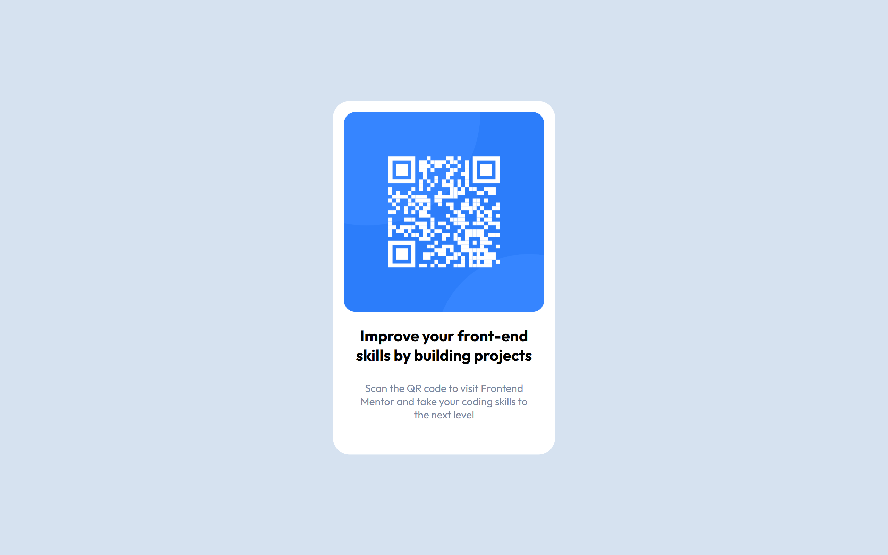

# Frontend Mentor - QR code component solution

This is a solution to the [QR code component challenge on Frontend Mentor](https://www.frontendmentor.io/challenges/qr-code-component-iux_sIO_H).

## Table of contents

- [Overview](#overview)
  - [Screenshot](#screenshot)
  - [Links](#links)
  - [Built with](#built-with)
- [Author](#author)

## Overview

### Screenshot

### Links

- Solution URL: [Add solution URL here](https://github.com/cprincec/frontendmentor/tree/main/qr-code-component-main)
- Live Site URL: [Add live site URL here](https://cprincec.github.io/frontendmentor/qr-code-component-main/design/)

### Built with

- Semantic HTML5 markup
- CSS custom properties
- Flexbox
- Mobile-first workflow
- Responsive layout technique (media queries)

## Author

- Website - [Prince Chukwu]
- Frontend Mentor - [@cprincec]
